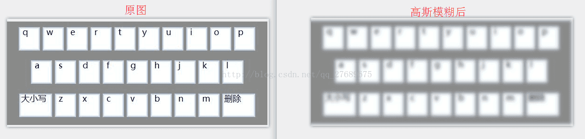

```java

import java.awt.Desktop;
import java.awt.image.BufferedImage;
import java.io.File;
import java.io.IOException;

import javax.imageio.ImageIO;

import filter.GaussianFilter;

/**
 * @author 汤姆
 * 高斯模糊
 *
 */

public class Test {
	public static void main(String[] args) {
		try {
			//读取原图
			File file = new File("c:\\image\\22.png");
			BufferedImage b1 = ImageIO.read(file);
			//模糊
			GaussianFilter filter = new GaussianFilter(10);
			BufferedImage blurredImage = filter.filter(b1, new BufferedImage(b1.getWidth(), b1.getHeight(), BufferedImage.TYPE_INT_ARGB));
			//保存处理后的图
			ImageIO.write(blurredImage, "png", file);

			//打开文件
			if (Desktop.isDesktopSupported()
					&& Desktop.getDesktop().isSupported(Desktop.Action.OPEN))
				Desktop.getDesktop().open(file);
		} catch (IOException e) {
			e.printStackTrace();
		}
	}
}
```

[高斯模糊所需jar包。点击这里获取](https://download.csdn.net/detail/qq_27689675/9810825)

​
