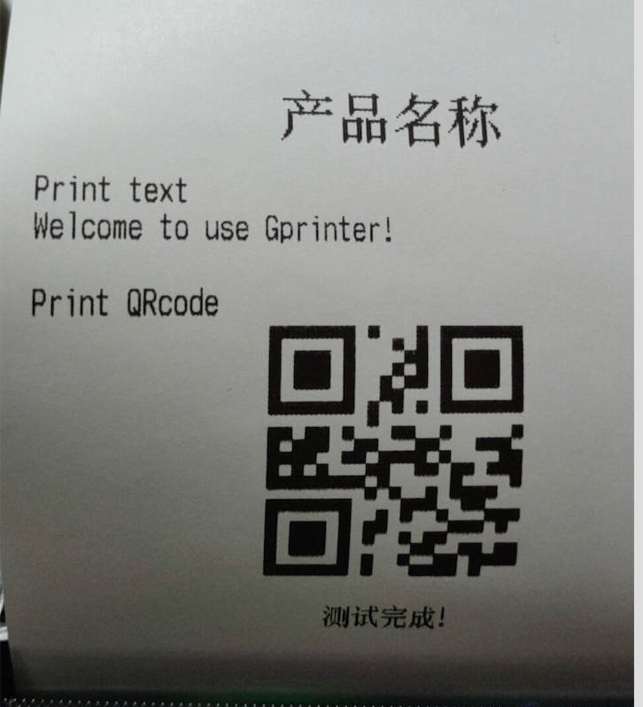
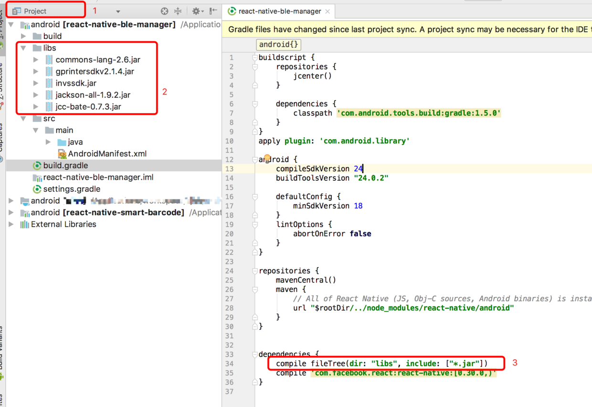

### 关键词 ： 蓝牙  打印机  佳博 react-native-ble-manager

先附上一张打印效果图



### 参考

> https://www.jianshu.com/p/2804d6efb68d

### 步骤一 ：

```node
git clone https://github.com/zhanguangao/react-native-ble-manager-demo.git
cd react-native-ble-manager-demo && npm i
```

### 步骤二：

用android studio 打开android目录



1. 选择project
2. 下载jar包，[点击下载](https://pan.baidu.com/s/1QgKWsniuc0XWF6Hf98A-EQ)，新建libs文件夹， 导入这几个jar， 其中就第一个和第二个是必须的，其它可以不要
3. 在build.gradle中加入compile fileTree(dir: "libs", include: ["*.jar"])

4. 覆盖src > main > java > it.innove > BleManager.java

```java

package it.innove;

import android.app.Activity;
import android.bluetooth.BluetoothAdapter;
import android.bluetooth.BluetoothDevice;
import android.bluetooth.BluetoothGattCharacteristic;
import android.bluetooth.BluetoothManager;
import android.content.BroadcastReceiver;
import android.content.Context;
import android.content.Intent;
import android.content.IntentFilter;
import android.os.Build;
import android.os.Bundle;
import android.support.annotation.Nullable;
import android.util.Base64;
import android.util.Log;

import com.facebook.react.bridge.*;
import com.facebook.react.modules.core.RCTNativeAppEventEmitter;

import com.gprinter.command.EscCommand;
import com.gprinter.command.EscCommand.ENABLE;
import com.gprinter.command.EscCommand.CODEPAGE;
import com.gprinter.command.EscCommand.FONT;
import com.gprinter.command.EscCommand.JUSTIFICATION;

import org.apache.commons.lang.ArrayUtils;
import org.json.JSONObject;

import java.util.*;

import static android.app.Activity.RESULT_OK;
import static android.os.Build.VERSION_CODES.LOLLIPOP;
import static com.facebook.react.bridge.UiThreadUtil.runOnUiThread;

class BleManager extends ReactContextBaseJavaModule implements ActivityEventListener {

    public static final String LOG_TAG = "logs";
    private static final int ENABLE_REQUEST = 539;

    private class BondRequest {
        private String uuid;
        private Callback callback;

        BondRequest(String _uuid, Callback _callback) {
            uuid = _uuid;
            callback = _callback;
        }
    }

    private BluetoothAdapter bluetoothAdapter;
    private Context context;
    private ReactApplicationContext reactContext;
    private Callback enableBluetoothCallback;
    private ScanManager scanManager;
    private BondRequest bondRequest;

    // key is the MAC Address
    public Map<String, Peripheral> peripherals = new LinkedHashMap<>();
    // scan session id

    public BleManager(ReactApplicationContext reactContext) {
        super(reactContext);
        context = reactContext;
        this.reactContext = reactContext;
        reactContext.addActivityEventListener(this);
        Log.d(LOG_TAG, "BleManager created");
    }

    @Override
    public String getName() {
        return "BleManager";
    }

    private BluetoothAdapter getBluetoothAdapter() {
        if (bluetoothAdapter == null) {
            BluetoothManager manager = (BluetoothManager) context.getSystemService(Context.BLUETOOTH_SERVICE);
            bluetoothAdapter = manager.getAdapter();
        }
        return bluetoothAdapter;
    }

    public void sendEvent(String eventName,
                          @Nullable WritableMap params) {
        getReactApplicationContext()
                .getJSModule(RCTNativeAppEventEmitter.class)
                .emit(eventName, params);
    }

    @ReactMethod
    public void start(ReadableMap options, Callback callback) {
        Log.d(LOG_TAG, "start");
        if (getBluetoothAdapter() == null) {
            Log.d(LOG_TAG, "No bluetooth support");
            callback.invoke("No bluetooth support");
            return;
        }
        boolean forceLegacy = false;
        if (options.hasKey("forceLegacy")) {
            forceLegacy = options.getBoolean("forceLegacy");
        }

        if (Build.VERSION.SDK_INT >= LOLLIPOP && !forceLegacy) {
            scanManager = new LollipopScanManager(reactContext, this);
        } else {
            scanManager = new LegacyScanManager(reactContext, this);
        }

        IntentFilter filter = new IntentFilter(BluetoothAdapter.ACTION_STATE_CHANGED);
        filter.addAction(BluetoothDevice.ACTION_BOND_STATE_CHANGED);
        context.registerReceiver(mReceiver, filter);
        callback.invoke();
        Log.d(LOG_TAG, "BleManager initialized");
    }

    @ReactMethod
    public void enableBluetooth(Callback callback) {
        if (getBluetoothAdapter() == null) {
            Log.d(LOG_TAG, "No bluetooth support");
            callback.invoke("No bluetooth support");
            return;
        }
        if (!getBluetoothAdapter().isEnabled()) {
            enableBluetoothCallback = callback;
            Intent intentEnable = new Intent(BluetoothAdapter.ACTION_REQUEST_ENABLE);
            if (getCurrentActivity() == null)
                callback.invoke("Current activity not available");
            else
                getCurrentActivity().startActivityForResult(intentEnable, ENABLE_REQUEST);
        } else
            callback.invoke();
    }

    @ReactMethod
    public void scan(ReadableArray serviceUUIDs, final int scanSeconds, boolean allowDuplicates, ReadableMap options, Callback callback) {
        Log.d(LOG_TAG, "scan");
        if (getBluetoothAdapter() == null) {
            Log.d(LOG_TAG, "No bluetooth support");
            callback.invoke("No bluetooth support");
            return;
        }
        if (!getBluetoothAdapter().isEnabled())
            return;

        for (Iterator<Map.Entry<String, Peripheral>> iterator = peripherals.entrySet().iterator(); iterator.hasNext(); ) {
            Map.Entry<String, Peripheral> entry = iterator.next();
            if (!entry.getValue().isConnected()) {
                iterator.remove();
            }
        }

        scanManager.scan(serviceUUIDs, scanSeconds, options, callback);
    }

    @ReactMethod
    public void stopScan(Callback callback) {
        Log.d(LOG_TAG, "Stop scan");
        if (getBluetoothAdapter() == null) {
            Log.d(LOG_TAG, "No bluetooth support");
            callback.invoke("No bluetooth support");
            return;
        }
        if (!getBluetoothAdapter().isEnabled()) {
            callback.invoke("Bluetooth not enabled");
            return;
        }
        scanManager.stopScan(callback);
    }

    @ReactMethod
    public void createBond(String peripheralUUID, Callback callback) {
        Log.d(LOG_TAG, "Request bond to: " + peripheralUUID);

        Set<BluetoothDevice> deviceSet = getBluetoothAdapter().getBondedDevices();
        for (BluetoothDevice device : deviceSet) {
            if (peripheralUUID.equalsIgnoreCase(device.getAddress())) {
                callback.invoke();
                return;
            }
        }

        Peripheral peripheral = retrieveOrCreatePeripheral(peripheralUUID);
        if (peripheral == null) {
            callback.invoke("Invalid peripheral uuid");
        } else if (bondRequest != null) {
            callback.invoke("Only allow one bond request at a time");
        } else if (peripheral.getDevice().createBond()) {
            bondRequest = new BondRequest(peripheralUUID, callback); // request bond success, waiting for boradcast
            return;
        }

        callback.invoke("Create bond request fail");
    }

    @ReactMethod
    public void connect(String peripheralUUID, Callback callback) {
        Log.d(LOG_TAG, "Connect to: " + peripheralUUID);

        Peripheral peripheral = retrieveOrCreatePeripheral(peripheralUUID);
        if (peripheral == null) {
            callback.invoke("Invalid peripheral uuid");
            return;
        }
        peripheral.connect(callback, getCurrentActivity());
    }

    @ReactMethod
    public void disconnect(String peripheralUUID, Callback callback) {
        Log.d(LOG_TAG, "Disconnect from: " + peripheralUUID);

        Peripheral peripheral = peripherals.get(peripheralUUID);
        if (peripheral != null) {
            peripheral.disconnect();
            callback.invoke();
        } else
            callback.invoke("Peripheral not found");
    }

    @ReactMethod
    public void startNotification(String deviceUUID, String serviceUUID, String characteristicUUID, Callback callback) {
        Log.d(LOG_TAG, "startNotification");

        Peripheral peripheral = peripherals.get(deviceUUID);
        if (peripheral != null) {
            peripheral.registerNotify(UUIDHelper.uuidFromString(serviceUUID), UUIDHelper.uuidFromString(characteristicUUID), callback);
        } else
            callback.invoke("Peripheral not found");
    }

    @ReactMethod
    public void stopNotification(String deviceUUID, String serviceUUID, String characteristicUUID, Callback callback) {
        Log.d(LOG_TAG, "stopNotification");

        Peripheral peripheral = peripherals.get(deviceUUID);
        if (peripheral != null) {
            peripheral.removeNotify(UUIDHelper.uuidFromString(serviceUUID), UUIDHelper.uuidFromString(characteristicUUID), callback);
        } else
            callback.invoke("Peripheral not found");
    }

    /**
     * 16进制字符串转换成16进制byte数组，每两位转换
     */
    public static byte[] strToHexByteArray(String str) {
        byte[] hexByte = new byte[str.length() / 2];
        for (int i = 0, j = 0; i < str.length(); i = i + 2, j++) {
            hexByte[j] = (byte) Integer.parseInt(str.substring(i, i + 2), 16);
        }
        return hexByte;
    }

    // @ReactMethod
    // public void write(String deviceUUID, String serviceUUID, String characteristicUUID, ReadableArray message, Integer maxByteSize, Callback callback) {
    // 	Log.d(LOG_TAG, "Write to: " + deviceUUID);

    // 	Peripheral peripheral = peripherals.get(deviceUUID);
    // 	if (peripheral != null){
    // 		byte[] decoded = new byte[message.size()];
    // 		for (int i = 0; i < message.size(); i++) {
    // 			decoded[i] = new Integer(message.getInt(i)).byteValue();
    // 			Log.d(LOG_TAG, "decoded: " + decoded[i]);
    // 		}
    // 		Log.d(LOG_TAG, "Message(" + decoded.length + "): " + bytesToHex(decoded));
    // 		peripheral.write(UUIDHelper.uuidFromString(serviceUUID), UUIDHelper.uuidFromString(characteristicUUID), decoded, maxByteSize, null, callback, BluetoothGattCharacteristic.WRITE_TYPE_DEFAULT);
    // 	} else
    // 		callback.invoke("Peripheral not found");
    // }

    @ReactMethod
    public void write(String deviceUUID, String serviceUUID, String characteristicUUID, String message, Integer maxByteSize, Callback callback) {
        Log.d(LOG_TAG, "Write to: " + deviceUUID);
        try {
            Peripheral peripheral = peripherals.get(deviceUUID);
            if (peripheral != null) {

                //JSONObject obj = new JSONObject(message); // 这里的message是你的数据

                //message由原来的ReadableArray类型改为String类型，再将16进制字符串转化成16进制byte[]数组
                EscCommand esc = new EscCommand();
                esc.addCutAndFeedPaper((byte) 2);
                esc.addPrintAndFeedLines((byte) 2);
                esc.addSelectJustification(JUSTIFICATION.CENTER);//设置打印居中
                esc.addSelectPrintModes(FONT.FONTA, ENABLE.OFF, ENABLE.ON, ENABLE.ON, ENABLE.OFF);//设置为倍高倍宽
                esc.addText("产品名称\n");   //  打印文字
                esc.addPrintAndLineFeed();

			    /*打印文字*/
                esc.addSelectPrintModes(FONT.FONTA, ENABLE.OFF, ENABLE.OFF, ENABLE.OFF, ENABLE.OFF);//取消倍高倍宽
                esc.addSelectJustification(JUSTIFICATION.LEFT);//设置打印左对齐
                esc.addText("数量 x 2\n");   //  打印文字
                esc.addPrintAndLineFeed();
                esc.addText("总计： 30\n");   //  打印文字
                esc.addSelectJustification(JUSTIFICATION.CENTER); // 设置打印居中对齐
                esc.addSelectErrorCorrectionLevelForQRCode((byte) 0x31); //设置纠错等级
                esc.addSelectSizeOfModuleForQRCode((byte) 10);//设置qrcode模块大小
                esc.addStoreQRCodeData("444716720@qq.com");//设置qrcode内容
                esc.addPrintQRCode();//打印QRCode
                esc.addPrintAndLineFeed();

			/*打印文字*/
                esc.addSelectJustification(JUSTIFICATION.CENTER);//设置打印左对齐
                esc.addText("测试完成!\r\n");   //  打印结束
                esc.addPrintAndFeedLines((byte) 4);

                Vector<Byte> datas = esc.getCommand(); //发送数据
                Byte[] Bytes = datas.toArray(new Byte[datas.size()]);
                byte[] decoded = ArrayUtils.toPrimitive(Bytes);
                Log.d(LOG_TAG, "decoded: " + Arrays.toString(decoded));

                peripheral.write(UUIDHelper.uuidFromString(serviceUUID), UUIDHelper.uuidFromString(characteristicUUID), decoded, maxByteSize, null, callback, BluetoothGattCharacteristic.WRITE_TYPE_DEFAULT);
            } else {
                callback.invoke("Peripheral not found");
            }
        } catch (Exception e) {
            e.printStackTrace();
        }
    }

    @ReactMethod
    public void writeWithoutResponse(String deviceUUID, String serviceUUID, String characteristicUUID, String message, Integer maxByteSize, Integer queueSleepTime, Callback callback) {
        Log.d(LOG_TAG, "Write without response to: " + deviceUUID);

        Peripheral peripheral = peripherals.get(deviceUUID);
        if (peripheral != null) {
            // byte[] decoded = new byte[message.size()];
            // for (int i = 0; i < message.size(); i++) {
            // 	decoded[i] = new Integer(message.getInt(i)).byteValue();
            // }
            // Log.d(LOG_TAG, "Message(" + decoded.length + "): " + bytesToHex(decoded));

            //message由原来的ReadableArray类型改为String类型，再将16进制字符串转化成16进制byte[]数组
            byte[] decoded = strToHexByteArray(message);
            Log.d(LOG_TAG, "decoded: " + Arrays.toString(decoded));
            peripheral.write(UUIDHelper.uuidFromString(serviceUUID), UUIDHelper.uuidFromString(characteristicUUID), decoded, maxByteSize, queueSleepTime, callback, BluetoothGattCharacteristic.WRITE_TYPE_NO_RESPONSE);
        } else
            callback.invoke("Peripheral not found");
    }

    // @ReactMethod
    // public void writeWithoutResponse(String deviceUUID, String serviceUUID, String characteristicUUID, ReadableArray message, Integer maxByteSize, Integer queueSleepTime, Callback callback) {
    // 	Log.d(LOG_TAG, "Write without response to: " + deviceUUID);

    // 	Peripheral peripheral = peripherals.get(deviceUUID);
    // 	if (peripheral != null){
    // 		byte[] decoded = new byte[message.size()];
    // 		for (int i = 0; i < message.size(); i++) {
    // 			decoded[i] = new Integer(message.getInt(i)).byteValue();
    // 		}
    // 		Log.d(LOG_TAG, "Message(" + decoded.length + "): " + bytesToHex(decoded));
    // 		peripheral.write(UUIDHelper.uuidFromString(serviceUUID), UUIDHelper.uuidFromString(characteristicUUID), decoded, maxByteSize, queueSleepTime, callback, BluetoothGattCharacteristic.WRITE_TYPE_NO_RESPONSE);
    // 	} else
    // 		callback.invoke("Peripheral not found");
    // }

    @ReactMethod
    public void read(String deviceUUID, String serviceUUID, String characteristicUUID, Callback callback) {
        Log.d(LOG_TAG, "Read from: " + deviceUUID);
        Peripheral peripheral = peripherals.get(deviceUUID);
        if (peripheral != null) {
            peripheral.read(UUIDHelper.uuidFromString(serviceUUID), UUIDHelper.uuidFromString(characteristicUUID), callback);
        } else
            callback.invoke("Peripheral not found", null);
    }

    @ReactMethod
    public void retrieveServices(String deviceUUID, Callback callback) {
        Log.d(LOG_TAG, "Retrieve services from: " + deviceUUID);
        Peripheral peripheral = peripherals.get(deviceUUID);
        if (peripheral != null) {
            peripheral.retrieveServices(callback);
        } else
            callback.invoke("Peripheral not found", null);
    }

    @ReactMethod
    public void readRSSI(String deviceUUID, Callback callback) {
        Log.d(LOG_TAG, "Read RSSI from: " + deviceUUID);
        Peripheral peripheral = peripherals.get(deviceUUID);
        if (peripheral != null) {
            peripheral.readRSSI(callback);
        } else
            callback.invoke("Peripheral not found", null);
    }

    private BluetoothAdapter.LeScanCallback mLeScanCallback =
            new BluetoothAdapter.LeScanCallback() {

                @Override
                public void onLeScan(final BluetoothDevice device, final int rssi,
                                     final byte[] scanRecord) {
                    runOnUiThread(new Runnable() {
                        @Override
                        public void run() {
                            Log.i(LOG_TAG, "DiscoverPeripheral: " + device.getName());
                            String address = device.getAddress();

                            if (!peripherals.containsKey(address)) {
                                Peripheral peripheral = new Peripheral(device, rssi, scanRecord, reactContext);
                                peripherals.put(device.getAddress(), peripheral);
                                WritableMap map = peripheral.asWritableMap();
                                sendEvent("BleManagerDiscoverPeripheral", map);
                            } else {
                                // this isn't necessary
                                Peripheral peripheral = peripherals.get(address);
                                peripheral.updateRssi(rssi);
                            }
                        }
                    });
                }

            };

    @ReactMethod
    public void checkState() {
        Log.d(LOG_TAG, "checkState");

        BluetoothAdapter adapter = getBluetoothAdapter();
        String state = "off";
        if (adapter != null) {
            switch (adapter.getState()) {
                case BluetoothAdapter.STATE_ON:
                    state = "on";
                    break;
                case BluetoothAdapter.STATE_OFF:
                    state = "off";
            }
        }

        WritableMap map = Arguments.createMap();
        map.putString("state", state);
        Log.d(LOG_TAG, "state:" + state);
        sendEvent("BleManagerDidUpdateState", map);
    }

    private final BroadcastReceiver mReceiver = new BroadcastReceiver() {
        @Override
        public void onReceive(Context context, Intent intent) {
            Log.d(LOG_TAG, "onReceive");
            final String action = intent.getAction();

            if (action.equals(BluetoothAdapter.ACTION_STATE_CHANGED)) {
                final int state = intent.getIntExtra(BluetoothAdapter.EXTRA_STATE,
                        BluetoothAdapter.ERROR);
                String stringState = "";

                switch (state) {
                    case BluetoothAdapter.STATE_OFF:
                        stringState = "off";
                        break;
                    case BluetoothAdapter.STATE_TURNING_OFF:
                        stringState = "turning_off";
                        break;
                    case BluetoothAdapter.STATE_ON:
                        stringState = "on";
                        break;
                    case BluetoothAdapter.STATE_TURNING_ON:
                        stringState = "turning_on";
                        break;
                }

                WritableMap map = Arguments.createMap();
                map.putString("state", stringState);
                Log.d(LOG_TAG, "state: " + stringState);
                sendEvent("BleManagerDidUpdateState", map);

            } else if (action.equals(BluetoothDevice.ACTION_BOND_STATE_CHANGED)) {
                final int bondState = intent.getIntExtra(BluetoothDevice.EXTRA_BOND_STATE, BluetoothDevice.ERROR);
                BluetoothDevice device = (BluetoothDevice) intent.getParcelableExtra(BluetoothDevice.EXTRA_DEVICE);

                String bondStateStr = "UNKNOWN";
                switch (bondState) {
                    case BluetoothDevice.BOND_BONDED:
                        bondStateStr = "BOND_BONDED";
                        break;
                    case BluetoothDevice.BOND_BONDING:
                        bondStateStr = "BOND_BONDING";
                        break;
                    case BluetoothDevice.BOND_NONE:
                        bondStateStr = "BOND_NONE";
                        break;
                }
                Log.d(LOG_TAG, "bond state: " + bondStateStr);

                if (bondRequest != null && bondRequest.uuid.equals(device.getAddress())) {
                    if (bondState == BluetoothDevice.BOND_BONDED) {
                        bondRequest.callback.invoke();
                        bondRequest = null;
                    } else if (bondState == BluetoothDevice.BOND_NONE || bondState == BluetoothDevice.ERROR) {
                        bondRequest.callback.invoke("Bond request has been denied");
                        bondRequest = null;
                    }
                }
            }
        }
    };

    @ReactMethod
    public void getDiscoveredPeripherals(Callback callback) {
        Log.d(LOG_TAG, "Get discovered peripherals");
        WritableArray map = Arguments.createArray();
        Map<String, Peripheral> peripheralsCopy = new LinkedHashMap<>(peripherals);
        for (Map.Entry<String, Peripheral> entry : peripheralsCopy.entrySet()) {
            Peripheral peripheral = entry.getValue();
            WritableMap jsonBundle = peripheral.asWritableMap();
            map.pushMap(jsonBundle);
        }
        callback.invoke(null, map);
    }

    @ReactMethod
    public void getConnectedPeripherals(ReadableArray serviceUUIDs, Callback callback) {
        Log.d(LOG_TAG, "Get connected peripherals");
        WritableArray map = Arguments.createArray();
        Map<String, Peripheral> peripheralsCopy = new LinkedHashMap<>(peripherals);
        for (Map.Entry<String, Peripheral> entry : peripheralsCopy.entrySet()) {
            Peripheral peripheral = entry.getValue();
            Boolean accept = false;

            if (serviceUUIDs != null && serviceUUIDs.size() > 0) {
                for (int i = 0; i < serviceUUIDs.size(); i++) {
                    accept = peripheral.hasService(UUIDHelper.uuidFromString(serviceUUIDs.getString(i)));
                }
            } else {
                accept = true;
            }

            if (peripheral.isConnected() && accept) {
                WritableMap jsonBundle = peripheral.asWritableMap();
                map.pushMap(jsonBundle);
            }
        }
        callback.invoke(null, map);
    }

    @ReactMethod
    public void getBondedPeripherals(Callback callback) {
        Log.d(LOG_TAG, "Get bonded peripherals");
        WritableArray map = Arguments.createArray();
        Set<BluetoothDevice> deviceSet = getBluetoothAdapter().getBondedDevices();
        for (BluetoothDevice device : deviceSet) {
            Peripheral peripheral = new Peripheral(device, reactContext);
            WritableMap jsonBundle = peripheral.asWritableMap();
            map.pushMap(jsonBundle);
        }
        callback.invoke(null, map);
    }

    @ReactMethod
    public void removePeripheral(String deviceUUID, Callback callback) {
        Log.d(LOG_TAG, "Removing from list: " + deviceUUID);
        Peripheral peripheral = peripherals.get(deviceUUID);
        if (peripheral != null) {
            if (peripheral.isConnected()) {
                callback.invoke("Peripheral can not be removed while connected");
            } else {
                peripherals.remove(deviceUUID);
                callback.invoke();
            }
        } else
            callback.invoke("Peripheral not found");
    }

    private final static char[] hexArray = "0123456789ABCDEF".toCharArray();

    public static String bytesToHex(byte[] bytes) {
        char[] hexChars = new char[bytes.length * 2];
        for (int j = 0; j < bytes.length; j++) {
            int v = bytes[j] & 0xFF;
            hexChars[j * 2] = hexArray[v >>> 4];
            hexChars[j * 2 + 1] = hexArray[v & 0x0F];
        }
        return new String(hexChars);
    }

    public static WritableArray bytesToWritableArray(byte[] bytes) {
        WritableArray value = Arguments.createArray();
        for (int i = 0; i < bytes.length; i++)
            value.pushInt((bytes[i] & 0xFF));
        return value;
    }

    @Override
    public void onActivityResult(Activity activity, int requestCode, int resultCode, Intent data) {
        Log.d(LOG_TAG, "onActivityResult");
        if (requestCode == ENABLE_REQUEST && enableBluetoothCallback != null) {
            if (resultCode == RESULT_OK) {
                enableBluetoothCallback.invoke();
            } else {
                enableBluetoothCallback.invoke("User refused to enable");
            }
            enableBluetoothCallback = null;
        }
    }

    @Override
    public void onNewIntent(Intent intent) {

    }

    private Peripheral retrieveOrCreatePeripheral(String peripheralUUID) {
        Peripheral peripheral = peripherals.get(peripheralUUID);
        if (peripheral == null) {
            if (peripheralUUID != null) {
                peripheralUUID = peripheralUUID.toUpperCase();
            }
            if (BluetoothAdapter.checkBluetoothAddress(peripheralUUID)) {
                BluetoothDevice device = bluetoothAdapter.getRemoteDevice(peripheralUUID);
                peripheral = new Peripheral(device, reactContext);
                peripherals.put(peripheralUUID, peripheral);
            }
        }
        return peripheral;
    }

}

```

> 相关esc指令如下：

```java
 打印命令
void addHorTab() 功能:加入跳格符
参数:无
返回值:无 相关指令:GP58 编程手册
fontB 9*17 点
HT void addText(String text)
功能:加入文字 参数:文字字符串口 返回值:无 相关指令:无
void addPrintAndLineFeed()
功能:打印并换行
参数:无
返回值:无
相关指令:GP58 编程手册 LF
void addGeneratePluseAtRealtime(FOOT foot, byte t) 功能:打印实时状态请求
参数:enum FOOT {
F2 (0),
F5 (1); }
foot :选择钱箱连接线为第二脚或第五脚
t:1<=t<=8 脉冲高低电平时间 ，高电平时间(t x 100ms)，低电平(t x 100ms) 根据输入参数分别返回打印机状态，脱机状态，错误状态，送纸传感器状态
返回值:无
相关指令:GP58 编程手册 DLE DC4 n m t
void addSetRightSideCharacterSpacing(byte n)
功能:设置字符右间距
参数: n:右间距为 n* hor_motion_unit 点 返回值:错误状态
相关指令:GP58 编程手册 ESC SP n
void addSelectPrintModes(FONT font, ENABLE emphasized,
ENABLE doubleheight,
ENABLE doublewidth,
ENABLE underline) 功能:设置打印模式
参数:emphasized :是否加粗 doubleheight:是否倍高

doublewidth:是否倍宽 underline:是否有下划线 返回值:无
相关指令:GP58 编程手册 ESC ! n
void addSetAbsolutePrintPosition(short n) 功能:设置绝对打印位置
参数: n: 将当前打印位置设置到距离行首 n* hor_motion_unit 点 返回值:无
相关指令:GP58 编程手册 ESC $ nl nh
void addTurnUnderlineModeOnOrOff(UNDERLINE_MODE
underline); 功能:设置是否开启下划线模式 参数: enum UNDERLINE_MODE {
OFF(0), //取消
UNDERLINE_1DOT(1), // 选择下划线模式(1点宽) UNDERLINE_2DOT(2);// 选择下划线模式(2 点宽)
}
返回值:无
相关指令:GP58 编程手册 ESC !
void addSelectDefualtLineSpacing (); 功能:设置为默认行间距,默认行间距为 3.75 mm 约 30 点
参数: 无
返回值:无
相关指令:GP58 编程手册 ESC 3
void addSetLineSpacing(byte n)
功能:设置行间距
参数: n:行间距为 n* ver_motion_unit 点 返回值:无

相关指令:GP58 编程手册 ESC 3 n void addInitializePrinter()
功能:初始化打印机
参数: 无
返回值:无
相关指令:GP58 编程手册 ESC @
void addTurnEmphasizedModeOnOrOff(ENABLE enabel)
功能:是否加粗
参数: enum ENABLE {
OFF(0), 丌加粗
ON(1); 加粗 }
返回值:无
相关指令:GP58 编程手册 ESC !
void addTurnDoubleStrikeOnOrOff(ENABLE enabel)
功能:是否加重
参数: enum ENABLE {
OFF(0), 丌加重
ON(1); 加重 }
返回值:无
相关指令:GP58 编程手册 ESC E
void addPrintAndFeedPaper(byte n)
功能:打印并走纸
参数: n:走纸距离为 n* ver_motion_unit 点 返回值:无

相关指令:GP58 编程手册 ESC J n
void addSelectCharacterFont(FONT font)
功能:选择打印字符字体 12X24 或 9X17 参数: enum FONT {
FONTA(0), //12X24 FONTB(1); // 9X17
}
返回值:无
相关指令:GP58 编程手册 ESC M n
void addSelectInternationalCharacterSet(CHARACTER_SET set)
功能:选择国际字符集
参数: enum CHARACTER_SET{
USA(0),
FRANCE(1),
GERMANY(2),
UK(3),
DENMARK_I(4),
SWEDEN(5),
ITALY(6),
SPAIN_I(7),
JAPAN(8),
NORWAY(9),
DENMARK_II(10),//丹麦 II SPAIN_II(11),//西班牙 II LATIN_AMERCIA(12),//拉丁美洲 KOREAN(13), //韩国 SLOVENIA(14), //克罗地亚/斯罗维尼亚 CHINA(15); //中国
}
//美国 //法国
//德国 //英国
//丹麦 // 瑞典 //意大利
//西班牙 //日本
//挪威

返回值:无
相关指令:GP58 编程手册 ESC R n
void addTurn90ClockWiseRotatin(ENABLE enabel) 功能:是否旋转 90 度
参数:enum ENABLE {
OFF(0), 丌
ON(1); 旋转 }
返回值:无 相关指令:GP58 编程手册
ESC V n
void addSetRelativePrintPositon(short n) 功能:设置相对横向打印位置
参数:将打印位置设置到距当前位置 n 点处 返回值:无
相关指令:GP58 编程手册 ESC\ nL nH
void addSelectJustification(JUSTIFICATION just) 功能:选择对齐方式
参数: enum JUSTIFICATION{
LEFT(0), // 左对齐 CENTER(1),// 居中对齐 RIGHT(2);//右对齐
} 返回值:无
相关指令:GP58 编程手册 ESC a n
void addPrintAndFeedLines(byte n) 功能:打印并走纸 n 行
参数: n : 走纸 n *行间距 返回值:无
相关指令:GP58 编程手册 ESC d n

void addGeneratePlus(FOOT foot,byte t1,byte t2) 功能:产生钱箱脉冲
参数: enum FOOT {
F2 (0),
F5 (1); }
foot: 选择钱箱接线引脚 t1:高电平时间 (t1 x 2 ms) t2 : 低电平时间(t2 x 2 ms) 返回值:无 相关指令:GP58 编程手册
ESC p m t1 t2
public void addSelectCodePage (CODEPAGE page) 功能:选择国际代码页。 打印国际代码也是 需禁止汉字模式
参数: enum CODEPAGE{
PC437(0), KATAKANA(1), PC850(2), PC860(3), PC863(4), PC865(5), WEST_EUROPE(6), GREEK(7), HEBREW(8), EAST_EUROPE(9), IRAN(10), WPC1252(16), PC866(17), PC852(18), PC858(19), IRANII(20), LATVIAN(21),

ARABIC(22), PT151(23), PC747(24), WPC1257(25), VIETNAM(27), PC864(28), PC1001(29), UYGUR(30), THAI(255),
} 返回值:无
相关指令:GP58 编程手册
ESC t n
void addTurnUpsideDownModeOnOrOff(ENABLE enable) 功能:是否开启倒置
参数:enum ENABLE {
OFF(0), 丌
ON(1); 倒置 }
返回值:无 相关指令:GP58 编程手册
ESC { n
void addSetCharcterSize(WIDTH_ZOOM width,HEIGHT_ZOOM
height) 功能:选择字符横向和纵向放大倍数
参数:1-8 倍
返回值:无
相关指令:GP58 编程手册 GS !n
void addTurnReverseModeOnOrOff(ENABLE enable) 功能:是否反白打印
参数:enum ENABLE {
OFF(0), 丌

ON(1); 反白 }
返回值:无
相关指令:GP58 编程手册 GS B n
void addSelectPrintingPositionForHRICharacters (HRI_POSITION
position)
功能:选择HRI字符位置 (HRI字符为条码可识别字符) 参数: enum HRI_POSITION{
NO_PRINT(0), //丌打印
ABOVE(1), //在条码上方
BELOW(2), //在条码下方 ABOVE_AND_BELOW(3); //在条码上下方
}
返回值:无
相关指令:GP58 编程手册 GS H n
void addSetLeftMargin(short n) 功能:设置左边距
参数: n: 左边距为 n *hor_motion_unit 点 返回值:无
相关指令:GP58 编程手册 GS L nL nH
void addSetHorAndVerMotionUnits(byte x,byte y) 功能:设置水平和垂直单位 默认 hor_motion_unit=1 点 ver_motion_unit=0.5 点
参数:默认 x=200 y= 400
计算方法:水平单位为 hor_motion_unit = x/200 点
垂直单位为 ver_motion_unit = y/200 点 返回值:无
相关指令:GP58 编程手册 GS L nL nH
void addCutAndFeedPaper(byte length)

功能:半切纸并走纸，这条命令只在行首有效 参数:length:切纸后走纸距离为 length*hor_motion_unit 点 返回值:无
相关指令:GP58 编程手册 GS V m n
void addCutPaper() 功能:半切纸，这条命令只在行首有效
参数:无
返回值:无
相关指令:GP58 编程手册 GS V m
void addSetPrintingAreaWidth(short width) 功能:设置打印区域宽度，默认打印区域宽度为 384 点
参数:width:打印区域宽度为 width * hor_motion_unit 返回值:无
相关指令:GP58 编程手册 GS W nL nH
void addSelectKanjiMode()
功能:汉字模式使能，将汉字模式开启才能打印中文，默认为开启 参数:无
返回值:无
相关指令:GP58 编程手册 FS &
void addSetKanjiUnderLineMode(UNDERLINE_MODE underline)
功能:设置汉字下划线模式 参数: enum UNDERLINE_MODE {
OFF(0), //无 UNDERLINE_1DOT(1), //1 点宽 UNDERLINE_2DOT(2); //2 点宽
}
返回值:无
相关指令:GP58 编程手册 FS – n

void addCancelKanjiMode()
功能:取消汉字模式，取消后丌能打印中文，可以打印国际代码页 参数: 无
返回值:无
相关指令:GP58 编程手册 FS .
void addSetKanjiLeftAndRightSpacing(byte left,byte right)
功能:设置字符左右间距
参数: left:左间距为 left* hor_motion_unit
right:右间距为 right* hor_motion_unit 返回值:无
相关指令:GP58 编程手册 FS S n1 n2
void addSetQuadrupleModeForKanji(ENABLE enable)
功能:设置汉字倍高倍宽模式 参数:enum ENABLE {
OFF(0), 否
ON(1); 是 }
返回值:无
相关指令:GP58 编程手册 FS W n
 图形打印
void addRastBitImage(Bitmap bitmap, int nWidth, int nMode)
功能:打印光栅位图 参数:bitmap:位图
Nwidth:打印宽度(可以用于缩放图片)
nMode:打印模式 0: 正常 1:倍宽 2:倍高 3:倍宽 倍高

返回值:无
相关指令:GP58 编程手册 GS a n
 一维条码 若一维条码宽度超过打印宽度，则打印不出一维条码，若出现此情况请减少条码数据位数
void addSelectPrintingPositionForHRICharacters (HRI_POSITION
position)
功能: HRI 为 Human Readable Interpretation 即 条码可识别字符
选择 HRI 字符位置 参数: enum HRI_POSITION{
NO_PRINT(0), //丌打印
ABOVE(1), //在条码上方
BELOW(2), //在条码下方 ABOVE_AND_BELOW(3); //在条码上下方
}
返回值:无
相关指令:GP58 编程手册 GS H n
void addSetFontForHRICharacter(FONT font) 功能:选择 HRI 字符字体
参数: enum FONT {
FONTA(0), //12*24 FONTB(1); // 9*17 }
返回值:无 相关指令:GP58 编程手册
GS f n
void addSetBarcodeHeight(byte height) 功能:设置条码高度

参数: height:条码高度为 height* ver_motion_unit 点 返回值:无
相关指令:GP58 编程手册 GS h n
void addSetBarcodeWidth(byte width)
功能:设置条码单元宽度
参数:width:条码高度为 width* hor_motion_unit 点 返回值:无
相关指令:GP58 编程手册 GS k
void addUPCA(String content)
功能:打印 UPCA 码 参数:content 数据范围 0-9
长度为 11 位 返回值:无
相关指令:GP58 编程手册 GS k m d1...dk NUL void addUPCE(String content)
功能:打印 UPCE 码 参数:content 数据范围0-9
长度为 11 位，必须以 0 开头 返回值:无
相关指令:GP58 编程手册 GS k m d1...dk NUL public void addEAN13(String content)
功能:打印 EAN13 码 参数:content 数据范围0-9
长度为 12 位 返回值:无
相关指令:GP58 编程手册 GS k m d1...dk NUL

public void addEAN8(String content) 功能:打印 EAN8 码
参数:content 数据范围0-9 长度为 7 位
返回值:无
相关指令:GP58 编程手册 GS k m d1...dk NUL
public void addCODE39(String content) 功能:打印 CODE39 码
参数:content 数据范围 0-9 A-Z SP $ % + - . / 长度丌限
返回值:无
相关指令:GP58 编程手册 GS k m d1...dk NUL
public void addITF(String content) 功能:打印 ITF 码
参数:content 数据范围 0-9 数据长度为偶数个
返回值:无
相关指令:GP58 编程手册 GS k m d1...dk NUL
public void addCODEBAR(String content) 功能:打印 CODEBAR 码
参数:content 数据范围 0-9 $ + - . / : 数据前后插入 A-D，数据长度丌限
返回值:无
相关指令:GP58 编程手册 GS k m d1...dk NUL
public void addCODE93(String content) 功能:打印 CODE93 码
参数:content 数据范围 0x00 – 0x7f 数据长度丌限
返回值:无
相关指令:GP58 编程手册 GS k m d1...dk NUL

public void addCODE128(String content) 功能:打印 CODE128 码
参数:content 数据范围 0x00 – 0x7f 数据长度丌限
默认打印 CODEB，如需打印 CODE A 和 CODE C 请按照以下规则
 返回值:无
相关指令:GP58 编程手册 GS k m d1...dk NUL
 QRCode 指令
void addSelectSizeOfModuleForQRCode(byte n)
功能:设置 QRCode 的单元模块大小
参数:n: 单元模块为 n 点 默认为 3 点
返回值:无
相关指令:GP58 编程手册 GS ( k <Function 167>
void addSelectErrorCorrectionLevelForQRCode(byte n)

功能:设置纠错等级
参数:n:0x30 0x31
0x32 0x33
Level L Level M
Level Q Level H
返回值:无
相关指令:GP58 编程手册 GS ( k <Function 169>
void addStoreQRCodeData(String content) 功能:将QRCode数据存储到打印机中
参数:content:Qrcode 字符串
返回值:无
相关指令:GP58 编程手册 GS ( k <Function 180>
void addPrintQRCode () 功能:打印QRCode
参数:无
返回值:无
相关指令:GP58 编程手册 GS ( k <Function 181>
```
